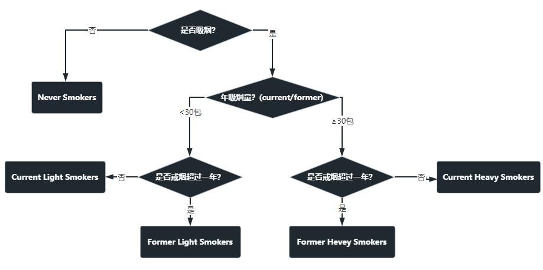

# 肺癌预测模型问卷
## 问卷设计

<table>
    <tr>
        <th><h2><b>指标</b></h2></th><th colspan="5"><h2><b>值</b></h2></th>
    </tr>
    <tr>
        <td  colspan="6"><h3><b># 基本信息</b></h3></td>
    </tr>
    <tr>
        <td>身高</td>
    </tr>
    <tr>
        <td>体重</td>
    </tr>
    <tr>
        <td>年龄</td><td><50</td><td>50-59</td><td>60-69</td><td>>=70</td>
    </tr>
    <tr>
        <td>性别</td><td>男</td><td>女</td>
    </tr>
    <tr>
        <td>体力活动水平</td><td>基本不活动</td><td>少量活动</td><td>大量活动</td>
    </tr>
    <tr>
        <td>慢阻肺(COPD)</td><td>有</td><td>无</td><td colspan="2">肺功能受限</td>
    </tr>
    <tr>
        <td>本人癌症史</td><td>有</td><td>无</td>
    </tr>
    <tr>
        <td>家族肺癌史</td><td>有</td><td>无</td>
    </tr>
    <tr>
        <td  colspan="6"><h3><b># 吸烟信息</b></h3></td>
    </tr>
    <tr>
        <td>是否吸烟</td><td>从不</td><td colspan="2">已戒烟超过一年</td><td colspan="2">仍在吸烟，或戒烟不超过一年</td>
    </tr>
    <tr>
        <td>年吸烟量</td><td><15包</td><td>15-30包</td><td>>30包</td>
    </tr>
    <tr>
        <td>每天吸烟量</td><td><1包</td><td>>=1包</td>
    </tr>
    <tr>
        <td  colspan="6"><h3><b># 指标信息</b></h3></td>
    </tr>
    <tr>
        <td>最大呼气中期流量(MMEF ml/sec)</td><td>0-48</td><td>49-54</td><td>55-77</td><td>78-103</td><td>>103</td>
    </tr>
        <tr>
        <td>一秒用力呼气容积(FEV1 %)</td><td>0-61</td><td>62-73</td><td>74-90</td><td>91-105</td><td>>106</td>
    </tr>
    <tr>
        <td>甲胎蛋白(AFP ng/ml)</td><td><1.8</td><td>>=1.8</td>
    </tr>
    <tr>
        <td>胆红素(Bilirubin mg/dl)</td><td>M:<=0.68 F: <=0.56</td><td>M:0.69-0.87 F: 0.57-0.70</td><td>M:0.88-1.11 F: 0.71-0.90</td><td>M:>=1.12 F: >=0.91</td>
    </tr>
    <tr>
        <td>癌胚抗原(CEA ng/ml)</td><td><1.5</td><td>1.5-2.5</td><td>2.6-4.2</td><td>4.3-7.0</td><td>>7.0</td>
    </tr>
    <tr>
        <td>C-反应蛋白(CRP mg/L)</td><td>0-1</td><td>1.1-3</td><td>3.1-10</td><td>>10</td>
    </tr>
</table>

## 问题
- 咱们做这个是为了指导病人，客户，是否值得继续做肺癌筛查。
- 因为文中用到的16项指标检查起来相对简单，且易获得，因此，我们要做的是不是要给出一个风险值，进而建议是否继续做肺癌筛查？在文章中确实提到了，如果五年癌症风险大于5%，则建议后续筛查。
- 通过对用户持续的监测这些指标，在有显著变化时，给出指导性意见，值得去继续做肺癌增强CT筛查。
- What is the MJ Group Integrative Risk Assessment Model? Any codes or descriptions?
- If not, can we just use the Risk Score to predict the Lung Cancer risk? However, it seems to be a very simple exponetial model.
- 什么是MJ Group Integrative Risk Assessment Model(MMIRA)? 有没有更详细的描述及代码？
- 如果没有，我们能不能用文中提到的Risk Score来预测肺癌风险？看起来是一个非常简单的打分模型。打分模型似乎剔除了 ***体力活动(physical activity)*** 和 ***慢阻肺(COPD)*** 两项指标，而且 ***胆红素(Bilirubin)*** 的分数始终是0。

- 关于打分表的计分方法，空白表示不考虑该项！
- 如何量化，never smokers, light smokers 和 heavy smokers？

